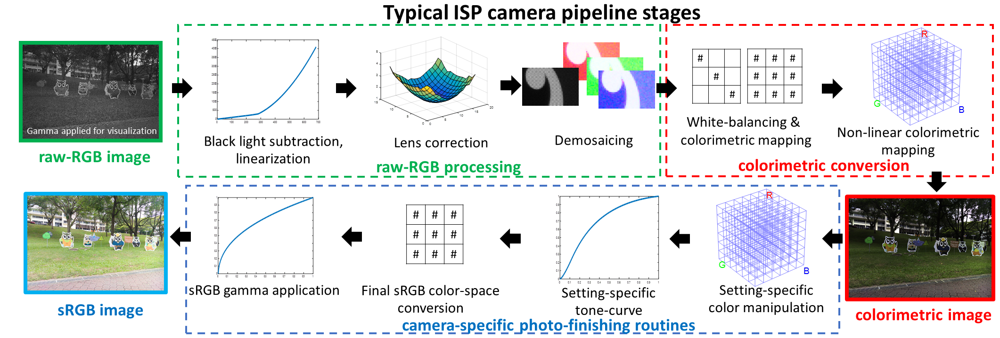

### Abstract ###
Most modern cameras allow captured images to be saved in two color spaces: (1) raw-RGB and (2) standard RGB (sRGB).  The raw-RGB image represents a scene-referred sensor image whose RGB values are specific to the color sensitivities of the sensor's color filter array.  The sRGB image represents a display-referred image that has been rendered through the camera's image signal processor (ISP).  The rendering process involves several camera-specific photo-finishing manipulations intended to make the sRGB image visually pleasing.   For applications that want to use a camera for purposes beyond photography, both the raw-RGB and sRGB color spaces are undesirable.  For example, because the raw-RGB color space is dependent on the camera's sensor, it is challenging to develop applications that work across multiple cameras.  Similarly, the camera-specific photo-finishing operations used to render sRGB images also hinder applications intended to run on different cameras.  Interestingly, the ISP camera pipeline includes a colorimetric conversion stage where the raw-RGB images are converted to a device-independent color space. However, this image state is not accessible.  In this paper, we advocate for the ability to access the colorimetric image state and recommend that cameras output a third image format that is based on this device-independent colorimetric space.  To this end, we perform experiments to demonstrate that image pixel values in a colorimetric space are more similar across different makes and models than sRGB and raw-RGB.

#### Publications: ####
* Karaimer H.C., Brown M.S. (2019) "Beyond raw-RGB and sRGB: Advocating Access to a Colorimetric Image State", *Color and Imaging Conference* (**CIC`19**), Oct 2019 [[pdf]](./paper/Karaimer_Brown_CIC19.pdf) [[bibtex]](./bib/Karaimer_Brown_CIC19.bib) 

## Code, Data, and Supplemental Material ##

Coming soon. 

## People ##
[Hakki Can Karaimer](https://karaimer.github.io/), 	karaimer (at) eecs.yorku.ca

[Michael S. Brown](http://www.cse.yorku.ca/~mbrown/), 	mbrown (at) eecs.yorku.ca
